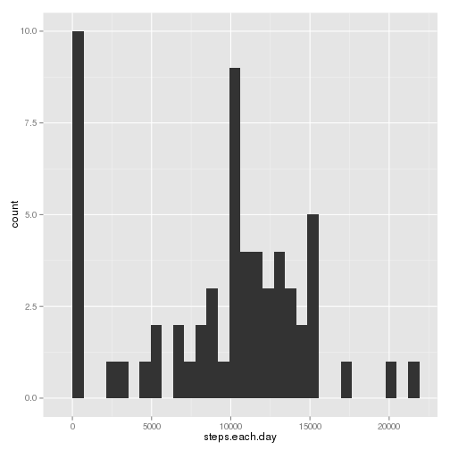
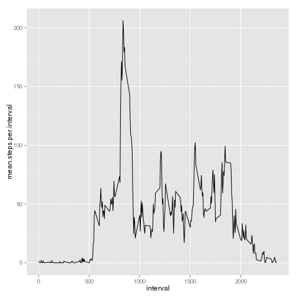
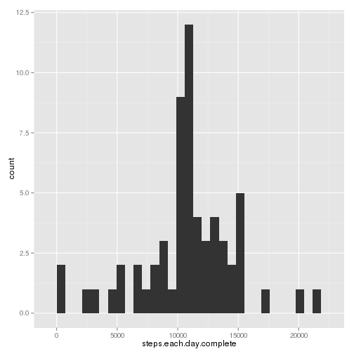
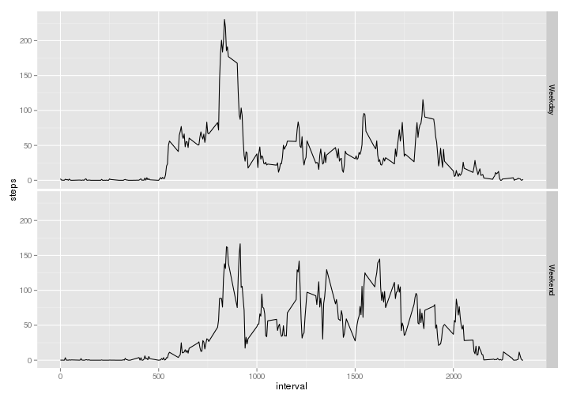

Reproducible Research
======================

1. Loading and preprocessing the data.
----------------------
Read data from activity.csv, with column class *Integer, Date and Integer*.


```r
data <- read.csv("activity.csv", colClass = c("integer", "Date", "integer"))
summary(data)
```

```
##      steps            date               interval   
##  Min.   :  0.0   Min.   :2012-10-01   Min.   :   0  
##  1st Qu.:  0.0   1st Qu.:2012-10-16   1st Qu.: 589  
##  Median :  0.0   Median :2012-10-31   Median :1178  
##  Mean   : 37.4   Mean   :2012-10-31   Mean   :1178  
##  3rd Qu.: 12.0   3rd Qu.:2012-11-15   3rd Qu.:1766  
##  Max.   :806.0   Max.   :2012-11-30   Max.   :2355  
##  NA's   :2304
```

```r
str(data)
```

```
## 'data.frame':	17568 obs. of  3 variables:
##  $ steps   : int  NA NA NA NA NA NA NA NA NA NA ...
##  $ date    : Date, format: "2012-10-01" "2012-10-01" ...
##  $ interval: int  0 5 10 15 20 25 30 35 40 45 ...
```

2. What is mean total number of steps taken per day?
----------------------

First, lets add up number of steps taken each day.


```r
steps.each.day <- tapply(data$steps, data$date, sum, na.rm = TRUE)
```


Then, we load ggplot2 library and use qplot to draw a histgram with 30 bins.


```r
library(ggplot2)
hist1 <- qplot(steps.each.day, binwidth = (max(steps.each.day) - min(steps.each.day))/30)
print(hist1)
```

 


Finally, the mean and median is calculated as below.


```r
mean.steps <- mean(steps.each.day)
median.steps <- median(steps.each.day)
```


We got: mean.steps = 9354.2295, and median = 10395 

3. What is the avergae daily activity pattern?
----------------------

First we calculate mean steps each interval.


```r
mean.steps.per.interval <- tapply(data$steps, data$interval, mean, na.rm = TRUE)
```

Then we draw the line graph.


```r
interval = as.numeric(rownames(mean.steps.per.interval))
qplot(interval, mean.steps.per.interval, geom = "line")
```

 


Finally, we find the maximum.


```r
index.max <- as.numeric(rownames(mean.steps.per.interval)[which(mean.steps.per.interval == 
    max(mean.steps.per.interval))])
hour <- floor(index.max/100)
minute <- index.max - hour * 100
```


Interval 835 contain the maximum number of steps.
It is 8:35

4. Inputing missing values
----------------------

First we use package **mice** to look for missings.


```r
library(mice)
```

```
## Loading required package: Rcpp
## mice 2.21 2014-02-05
```

```r
md.pattern(data)
```

```
##       date interval steps     
## 15264    1        1     1    0
##  2304    1        1     0    1
##          0        0  2304 2304
```

```r
num.missings <- sum(is.na(data$steps))
```


There are 2304 missing steps in activity.csv.

Then we fill the missings with mean of the same interval across all days.


```r
find.mean <- function(interval) {
    mean.steps.per.interval[as.character(interval)]
}
complete.data <- data
for (i in 1:nrow(complete.data)) {
    if (is.na(complete.data$steps[i])) {
        complete.data$steps[i] <- find.mean(complete.data$interval[i])
    }
}
md.pattern(complete.data)
```

```
##      steps date interval  
## [1,]     1    1        1 0
## [2,]     0    0        0 0
```


Histgram of the complete data is shown below.


```r
steps.each.day.complete <- tapply(complete.data$steps, complete.data$date, sum, 
    na.rm = TRUE)
hist2 <- qplot(steps.each.day.complete, binwidth = (max(steps.each.day.complete) - 
    min(steps.each.day.complete))/30)
print(hist1)
```

 

```r
print(hist2)
```

 

```r
mean.steps.complete <- mean(steps.each.day.complete)
median.steps.complete <- median(steps.each.day.complete)
```


We got:   mean.steps = 1.0766 &times; 10<sup>4</sup>, and median = 1.0766 &times; 10<sup>4</sup> 

Original: mean.steps = 9354.2295, and median = 10395 

By comparison, we found that as we replace missings with mean, daily activity is closer to a gaussian distribution. 


5. Are there differences in activity patterns between weekdays and weekends:
----------------------

Here we use package **reshape** to group Original data by daytype.


```r
complete.data$daytype <- format(complete.data$date, "%u")
complete.data$daytype <- complete.data$daytype > 5
library(reshape2)
week.data <- melt(complete.data, id = c("interval", "daytype", "date"), measure.vars = c("steps"))
week.data <- dcast(week.data, interval + daytype ~ variable, mean)
week.data$daytype <- factor(as.integer(week.data$daytype), label = c("Weekday", 
    "Weekend"))
```


The final graph shown here.


```r
qplot(interval, steps, data = week.data, geom = "line", facets = daytype ~ .)
```

 

